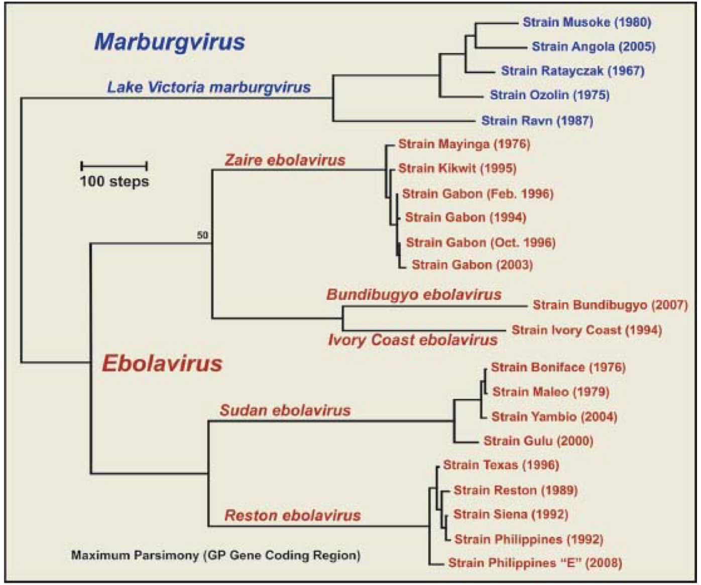
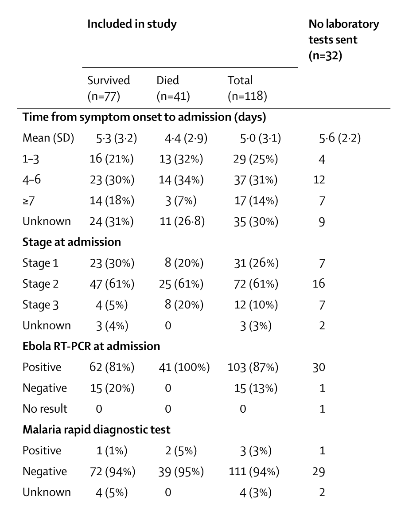
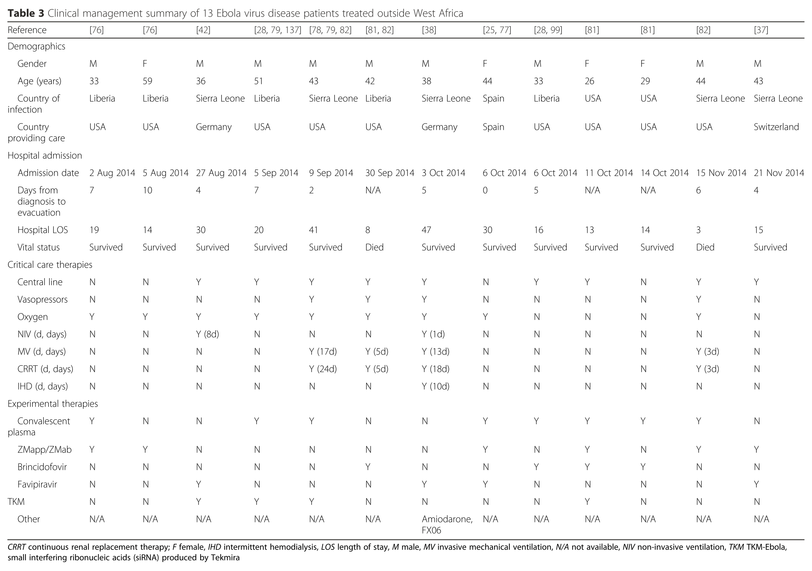
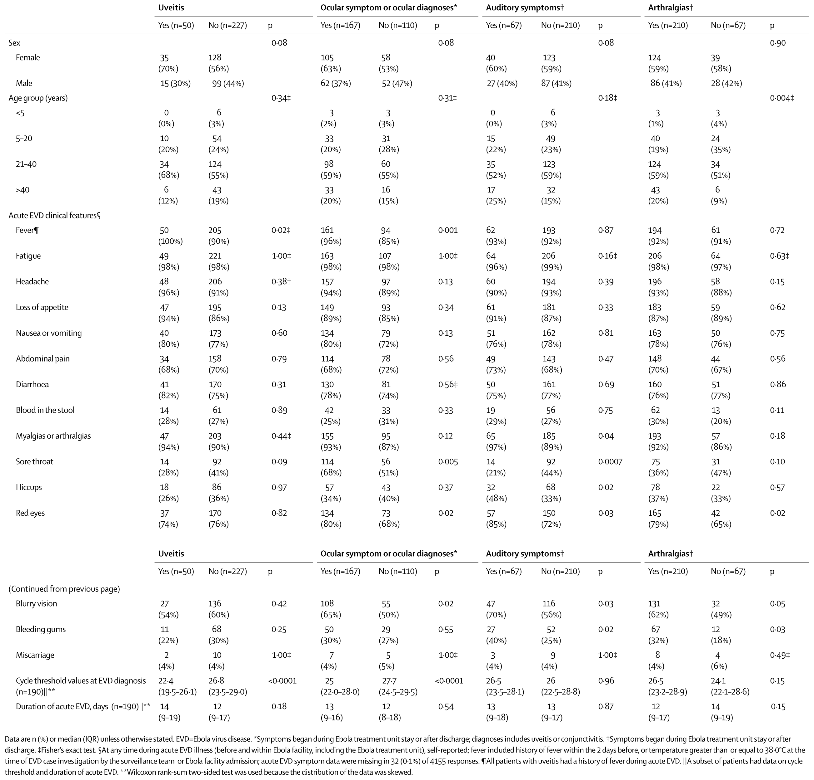
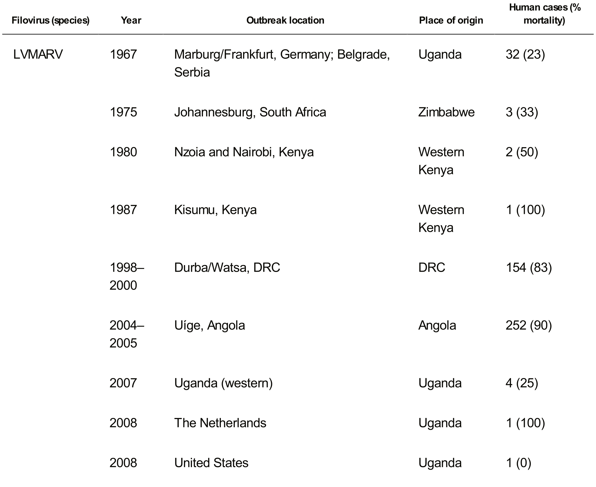
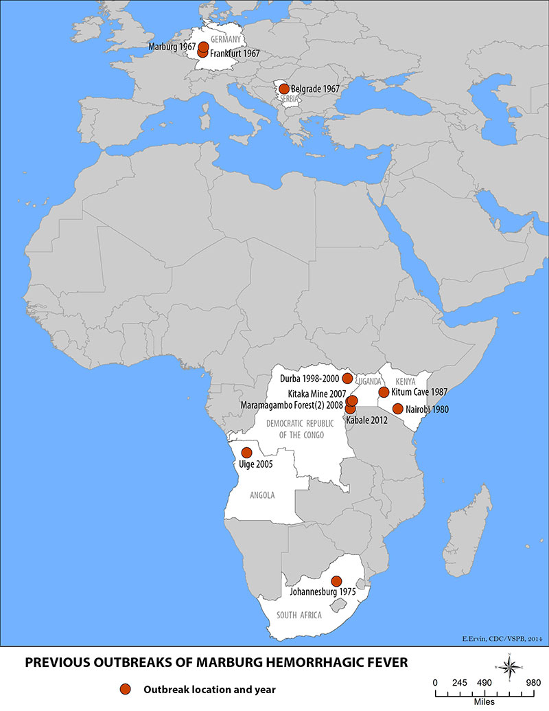

## Road Map

- Generics about filoviruses
    - General classification
    - Molecular biology
- Ebolavirus
    - History of Ebola infections
    - Microbiological basics
    - Evolution and Ecology
    - Epidemiology in human populations
    - Infection course
    - Case confirmation and Treatment
    - Infection control measures
    - Future directions
- Marburg
    - History of Marburg infections
    - Epidemiology and Phylogeny of Marburg
    
# Generics about filoviruses

## General Classification

- BSL-4 Agents

- They are moderately hardy
    - Killed by 30 minutes at \(60^o\)
    - Somewhat resistant to dessication
    - Infecitivity is significantly reduced by UV light, lipid solvents, and many other disinfectants

- All are bioterrorism select agents    

## Specific molecular notes

- Genome is (-)ssRNA
    - Has approximately 19,000 bases
    - Very similar to paramyxoviruses and rhabdoviruses
    - Codes for only 7 genes
    - Encodes RNA-dependent RNA polymerase like other (-)ssRNA viruses

- Very error prone polymerase would be expected to lead to high mutagenesis

- Until the recent outbreak, structure of binding/fusion glycoprotein was unkown

- Outer envelope derived from host-cell membrane

- Ebola uses human cellular receptor is Endosomal Niemann pick type C1 (NPC1)

# Ebolaviruses

# History of Ebolavirus

## Outbreaks first recognized in 1976

{width=2000px}
<aside class="notes">
Two outbreaks occurred simultaneously in 1976 with Ebola Sudan and Ebola Zaire. They lasted approximately 2 months each and both were fueled by high transmission within local hospitals. At the time, they were reusing syringes. The hospitals were closed and that halted the outbreaks. Ebola Sudan emerged again in 1979 from the same factory that caused the first outbreak. Then, the virus went silent for 15 years. In 1994, there was a single person infected in Ivory Coast with a new strain. Also in 1994, Zaire Ebola became generically active in the border region between Gebon and Republic of Congo. The 1995 Kikwit outbreak was the next big isolated emergence. Then in the 2000s there were a number of outbreaks in Central Africa and the first in Uganda along with the emergence of Bundibugyo. Finally there was the huge Zaire Ebola virus outbreak in 2014.
</aside>

# Microbiological basics of Ebolavirus

## Ebolavirus has an extremely characteristic look

{width=2000px}

# Ebolavirus Evolution and Ecology

## There are five clades of Ebolavirus

{height=650px}

## The most active recently in West Africa was ZEBOV

{width=2000px}

## ZEBOV has been evolving continously since its emergence

{height=650px}

## Stable mutations arose in 2014 leading to increased infectivity

{height=650px}

## The primary ecological reservoir is thought to be bats
 
- The smoking gun for the bat reservoir has been elusive.
    - Lots of controversy exists surrounding this issue
    - Experiments w/ wild bats have shown the animals can support the virus w/o becoming ill

- Ebolavirus can infect many mammals including pigs, primates, and bats.

- Primate epidemics are relatively common and often precede human outbreaks.
    - Infamous for decimating wild primate populations (particularly gorillas and chimps)
    - They are stable aerosols
    - Aerosolized transfer does occur in non-human primates
    - Has been shown with SEBOV and ZEBOV in several monkey species
 
# Epidemiology in human populations

## How do outbreaks start?

- Index cases are almost always bush hunters
    - Thought to be transmitted through body fluids of bush meat
    
- Almost always a single source introduction

- Secondary transmission rates in humans vary from 5-25%

- Risk for close household contacts is around 25%

- Risk for nurses without protective equipment is upwards of 80%

## How do outbreaks persist?

- Failure of recognition often leads to major nosocomial explosion early
    - The syndrome resembles malaria and influenza
    - Early in outbreaks, the spread resembles the flu
    - Differential also includes Measles, Lassa Fever, Typhoid and Meningoccocal infection (also Marburg)

- Easily passed in virtually all body fluids

- Nosocomial transmission is the single biggest issue
    - Of 16,000 confirmed cases in 2014-2015, about 1000 were healthcare workers

- Household caretakers and burial practitioners are also at high risk

- Cultural practices contribute to spreading
    - The virus persists in dead bodies 
    - Elaborate burial rituals can cause super spreading
    - During recent outbreak, there were teams of people who burned the bodies

- Virus can persist in semen and vaginal secretions for a year or more

- Current WHO recommendation is abstinence for 3 months after symptom onset

- A large fraction of infections may be asymptomatic
    - Explains the apparent burnout and subsequent reactivation cycle in several areas

## How do outbreaks end?

- The basic reproduction number of Ebola is relatively low and less than 1 with interventions (this is no SARS)

- Prior to 2014, outbreaks could be halted simply by closing the hospital

- In Africa, the disease is often fatal
    - ZEBOV 1976: 318 cases, 88% CFR
    - SEBOV 1976: 284 cases, 53% CFR
    - ZEBOV 1995: 315 cases, 81% CFR
    - SEBOV 2000: 425 cases, 53% CFR
    - BEBOV 2007:  56 cases, 41% CFR
    - BEBOV 2012:  52 cases, 48% CFR
    
- Most outbreaks end within 2 months

## How about the 2014 outbreak?

{width=2000px}

# Infection course

## Preclinical infection course is highly variable

{height=650px}

<aside class="notes">
Our best information comes from 2014 ZEBOV and there is obviously some variation between species.
</aside>

## Clinical disease according to CDC case definition

- CDC case definition
    - Elevated body temperature or subjective fever or symptoms, including severe headache, fatigue, muscle pain, vomiting, diarrhea, abdominal pain, or unexplained hemorrhage; **AND**
    - An **epidemiologic risk factor** within the 21 days before the onset of symptom

- High Risk
    - Needlestick from symptomatic individuals
    - Direct contact with infected person **while not wearing appropriate PPE**
    - Lab processing of body fluids **while not wearing appropriate PPE**
    - Providing direct care to a person showing symptoms of Ebola in a household setting
- Some Risk
    - Any country: Being in close contact with infected person
    - Country with widespread transmission: Direct contact with infected person **while wearing appropriate PPE**
    - Country with widespread transmission: Being in an ETU
    - Country with widespread transmission: Providing any care to an infected person
- Low Risk
    - Any country: Brief contact with infected person (shaking hands) w/o wearing PPE
    - Any country: Lab processing of fluids while wearing appropriate PPE and following standard biosafety precautions
    - Any country w/o widespread transmission: Direct contact with infected person **while wearing appropriate PPE**
    - Being in a country with widepsread transmission and nothing else
    
## Clinical disease of 37 cases in 2014

{height=650px}

<aside class="notes">
The syndrome is extremely non-specific and overlaps with many regional diseases
</aside>

## Rare symptoms were diagnostic markers in 2014 DRC outbreak

{height=650px}

## Time course of the disease can be useful for treatment

{height=650px}

# Case confirmation and Treatment

## Testing is straightforward

- All tests including viral load can be undetectable until about **3 days after symptoms**

- First few days
    - Antigen-capture enzyme-linked immunosorbent assay (ELISA) testing
    - IgM ELISA
    - rtPCR
    - Virus isolation

- After recovery: IgM and IgG antibodies

- After death
    - Immunohistochemistry testing
    - rtPCR
    - Virus isolation
    
## In field, treatment is generally based on a staging system

{width=2000px}

## On presentation, most patients are actually in Stage 2

{height=650px}

## In modern ICU, treatment varies widely and survival is better

{height=650px}

# Outcomes of Ebola infection

## Young people with low viral load tend to survive: Guinea

{width=2000px}

## Young people with low viral load tend to survive: Sierra Leone

{height=650px}

## However, there are many good mortality predictors

{width=2000px}

## For survivors, features of early sequelae are predictable

{height=650px}

# Infection control measures

## Infection control PPE protocol is extensive

{height=650px}

## Often infection control is easier said than done

# Future directions

- Most vaccines are relatively early in development

## The most promising is Merck's rVSV-vectored ZEBOV vaccine

{height=650px}

# Marburg Virus

# Not a whole lot is known.   Only one species has been characterized.

## A little history of the virus

{height=650px}

## Distribution of Marburg Virus outbreaks

{height=650px}

## Marburg doesn't sort as easily on a tree

{height=650px}

## Beyond some minor genetic differences

- Epidemiology is poorly characterized due to limited size and remoteness of outbreaks
    - At least one of the outbreaks originated in a bat infested mine
    - Geography is similar to that of EBOV
    
- Disease
    - Symptoms and course are similar to EBOV
    - Marburg virus hemorrhagic fever may be more deadly than SEBOV and is probably more similar to ZEBOV

- Sequelae are not well described

# The End