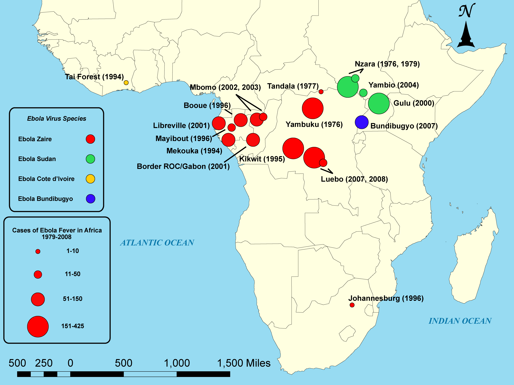

## Road Map

- Ebolavirus
    - Brief history
    - Microbiological basics
    - Evolution and Ecology
    - Epidemiology in human populations
    - Common presentations
    - Case confirmation and Treatments
    - Future directions
- Marburg
    - What we know about it

# History of Ebolavirus

## Outbreaks first recognized in 1976

{width=800px}
<aside class="notes">
Two outbreaks occurred simultaneously in 1976 with Ebola Sudan and Ebola Zaire. They lasted approximately 2 months each and both were fueled by high transmission within local hospitals. At the time, they were reusing syringes. The hospitals were closed and that halted the outbreaks. Ebola Sudan emerged again in 1979 from the same factory that caused the first outbreak. Then, the virus went silent for 15 years. In 1994, there was a single person infected in Ivory Coast with a new strain. Also in 1994, Zaire Ebola became generically active in the border region between Gebon and Republic of Congo. The 1995 Kikwit outbreak was the next big isolated emergence. Then in the 2000s there were a number of outbreaks in Central Africa and the first in Uganda along with the emergence of Bundibugyo. Finally there was the huge Zaire Ebola virus outbreak in 2014.
</aside>

# Microbiological basics of Ebolavirus

## Ebolavirus has an extremely characteristic look

{width=800px}

## Specific molecular notes

- Genome is (-)ssRNA
    - Has approximately 19,000 bases
    - Very similar to paramyxoviruses and rhabdoviruses
    - Codes for only 7 genes
    - Encodes RNA-dependent RNA polymerase like other (-)ssRNA viruses

- Very error prone polymerase would be expected to lead to high mutagenesis

- Until the recent outbreak, structure of binding/fusion glycoprotein was unkown

- Outer envelope derived from host-cell membrane

- Human cellular receptor is Endosomal Niemann‐pick type C1 (NPC1)

# Ebolavirus Evolution and Ecology

## There are five clades of Ebolavirus

{width=800px}

## The most active recently in West Africa was ZEBOV

{width=900px}

## ZEBOV has been evolving continously since its emergence

{width=600px}

