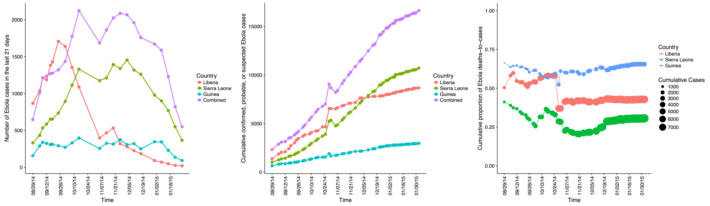

## Road Map

- Ebolavirus
    - Brief history
    - Microbiological basics
    - Evolution and Ecology
    - Epidemiology in human populations
    - Infection course
    - Case confirmation and Treatment
    - Infection control measures
    - Future directions
- Marburg
    - What we know

# History of Ebolavirus

## Outbreaks first recognized in 1976

{width=900px}
<aside class="notes">
Two outbreaks occurred simultaneously in 1976 with Ebola Sudan and Ebola Zaire. They lasted approximately 2 months each and both were fueled by high transmission within local hospitals. At the time, they were reusing syringes. The hospitals were closed and that halted the outbreaks. Ebola Sudan emerged again in 1979 from the same factory that caused the first outbreak. Then, the virus went silent for 15 years. In 1994, there was a single person infected in Ivory Coast with a new strain. Also in 1994, Zaire Ebola became generically active in the border region between Gebon and Republic of Congo. The 1995 Kikwit outbreak was the next big isolated emergence. Then in the 2000s there were a number of outbreaks in Central Africa and the first in Uganda along with the emergence of Bundibugyo. Finally there was the huge Zaire Ebola virus outbreak in 2014.
</aside>

# Microbiological basics of Ebolavirus

## Ebolavirus has an extremely characteristic look

{width=800px}

## Specific molecular notes

- Genome is (-)ssRNA
    - Has approximately 19,000 bases
    - Very similar to paramyxoviruses and rhabdoviruses
    - Codes for only 7 genes
    - Encodes RNA-dependent RNA polymerase like other (-)ssRNA viruses

- Very error prone polymerase would be expected to lead to high mutagenesis

- Until the recent outbreak, structure of binding/fusion glycoprotein was unkown

- Outer envelope derived from host-cell membrane

- Human cellular receptor is Endosomal Niemann‐pick type C1 (NPC1)

# Ebolavirus Evolution and Ecology

## There are five clades of Ebolavirus

{width=800px}

## The most active recently in West Africa was ZEBOV

{width=900px}

## ZEBOV has been evolving continously since its emergence

{width=600px}

## Stable mutations arose in 2014 leading to increased infectivity

{width=600px}

## The primary ecological reservoir is thought to be bats
 
- The smoking gun for the bat reservoir has been elusive.
    - Lots of controversy exists surrounding this issue
    - Experiments w/ wild bats have shown the animals can support the virus w/o becoming ill

- Ebolavirus can infect many mammals including pigs, primates, and bats.

- Primate epidemics are relatively common and often precede human outbreaks.
    - Infamous for decimating wild primate populations (particularly gorillas and chimps)
    - They are stable aerosols
    - Aerosolized transfer does occur in non-human primates
    - Has been shown with SEBOV and ZEBOV in several monkey species
 
# Epidemiology in human populations

## How do outbreaks start?

- Index cases are almost always bush hunters
    - Thought to be transmitted through body fluids of bush meat
    
- Almost always a single source introduction

- Secondary transmission rates in humans vary from 5-25%

- Risk for close household contacts is around 25%

- Risk for nurses without protective equipment is upwards of 80%

## How do outbreaks persist?

- Easily passed in virtually all body fluids

- Nosocomial transmission is the single biggest issue
    - Of 21,000 cases in 2014-2015, about 1000 were healthcare workers

- Household caretakers are also at risk

- Cultural practices contribute to spreading
    - The virus persists in dead bodies 
    - Elaborate burial rituals can cause super spreading
    - During recent outbreak, there were teams of people who burned the bodies

- Early in diease, the syndrome resembles the flu

- Early in outbreaks, the syndrome resembles malaria

- Virus can persist in semen and vaginal secretions for a year or more
    - Current WHO recommendation is abstinence for 3 months after symptom onset

## How do outbreaks end?

- The basic reproduction number of Ebola is relatively low

- Prior to 2014, outbreaks could be halted simply by closing the hospital

- In Africa, the disease is often fatal
    - ZEBOV 1976: 318 cases, 88% CFR
    - SEBOV 1976: 284 cases, 53% CFR
    - ZEBOV 1995: 315 cases, 81% CFR
    - SEBOV 2000: 425 cases, 53% CFR
    - BEBOV 2007:  56 cases, 41% CFR
    - BEBOV 2012:  52 cases, 48% CFR
    
- Most outbreaks end within 2 months

## How about the 2014 outbreak?

{width=2000px}

# Infection course

## Preclinical infection

## Clinical disease

## Postclinical sequelae

# Case confirmation and Treatment

## Testing is straightforward

## Treatment is limited, but effective

# Infection control measures

## There are now extensive infection control guidelines

## Often infection control is easier said than done

# Future directions

## There are numerous vaccine trials

## The most promising used a cluster randomized design

# Marburg Virus

# What we know? Not much.

## A little history of the virus

## What it looks like

## What to expect in the future